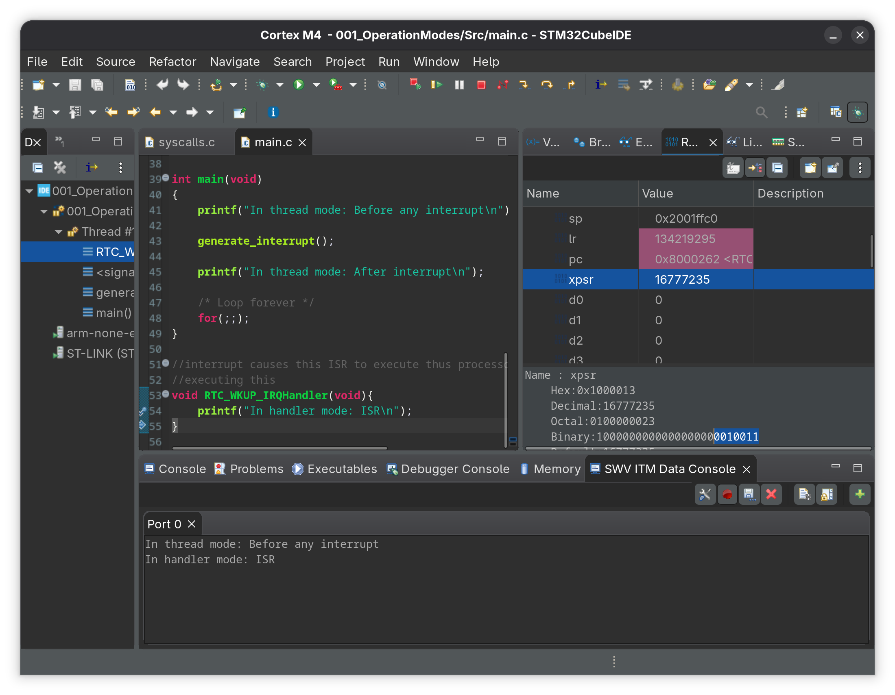

# 001_OperationModes

Demonstrates the transition between thread mode and handler mode. 

## Registers Used

| Register | Address | Purpose |
|---|---|---|
| ISER0 | 0xE000E100 | Interrupt Set Enable it enables IRQ3 |
| STIR | 0xE000EF00 | Software Trigger Interrupt Register |

## Execution Flow

```
Thread Mode → generate_interrupt()
    → ISER0 enables IRQ3
        → STIR triggers IRQ3
            → Handler Mode → RTC_WKUP_IRQHandler()
                → returns to Thread Mode
```

## Output

### Cubeide displaying the output via SWV ITM data console

