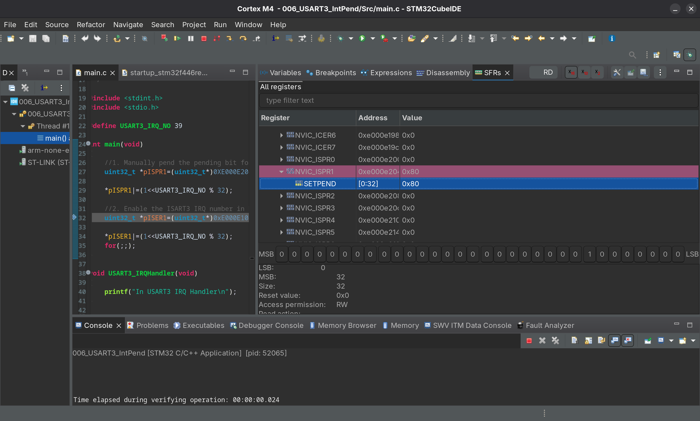

# 006_USART3_IntPend

- Manually pend the pending bit for the USART3 IRQ number in NVIC using the ISPR1 register
- Then enabling the USART 3 IRQ in NVIC via the ISER1 register thus triggering the ISR and clearing the pending bit

## 7th bit being set ISPR1 reg (7th bit corresponds to the 39th IRQ number)

