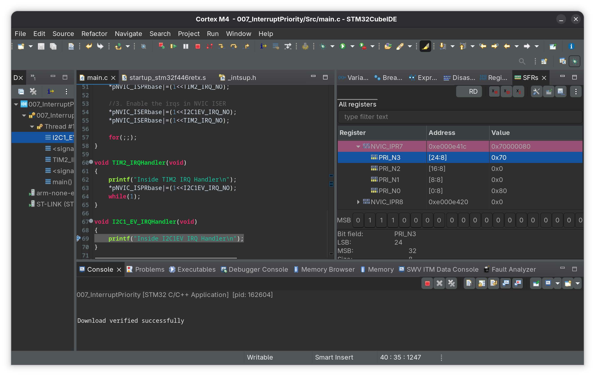

# 007_InterruptPriority

2 different priority interrupts are set manually using Interrupt priority registers (IPR) and then triggered via Interrupt set pending register (ISPR) and the enabled via the Interrupt Set Enable registers (ISER)

- Higher prio interrupt is triggered from the ISR of the lower prio interrupt 
- The processor exits the lower prio interrupt ISR then executes the higher prio ISR and then resumes the lower prio ISR 

## Cubeide displaying the priority values assigned in the IPR7 register

