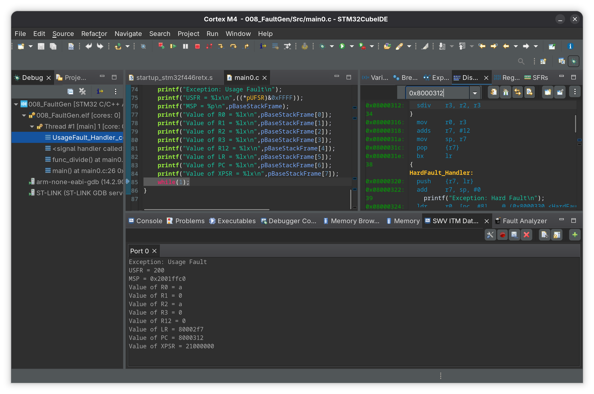

# 008_FaultGen

Two fault scenarios are triggered manually to demonstrate UsageFault handling and exception stack frame analysis via the usage fault status register (UFSR) and MSP registers

- All configurable faults enabled via SHCRS (mem manage, bus fault, usage fault)
- A `naked` UsageFault_Handler extracts MSP via inline assembly and passes it as a pointer to the C UsageFault_Handler
- The C UsageFault_Handler reads the saved exception stack frame directly using pointer indexing to print R0-R12, LR, PC and xPSR

## main.c (Undefined Instruction Fault)
- Writes `0xFFFFFFFF` into SRAM at `0x20010000`
- Jumps to that address via a function pointer and the processor tries to execute `0xFFFFFFFF` as a Thumb instruction
- Undefined instruction triggers UsageFault

## main0.c (Divide by Zero Fault)
- Enables divide by zero trap via bit 4 of the CCR (`0xE000ED14`)
- Calls `func_divide(10, 0)` which triggers UsageFault on the division

## Cubeide displaying the values of the stack frames for both the faults
| File | Stack Frame values |
|------|--------------------|
| main.c |  |
| main0.c |  |
