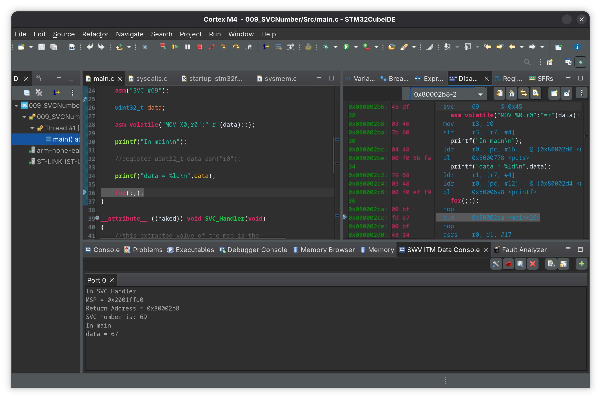

# 009_SVCNumber

Extracting the SVC number from the opcode in program memory using the saved exception stack frame and return address.

- `SVC #69` is triggered from main
- A `naked` SVC_Handler extracts MSP via inline assembly and passes it to the SVC_Handler_c 
- The SVC_Handler_c reads the saved PC from the stack frame and decrements it by 2 to point to the SVC instruction opcode in flash
- The SVC number is extracted from the LSB of the opcode
- R0 in the stack frame is modified to return `svc_number - 2` back to main which is in thread mode

## Cube ide showing the disassembly and the SWV ITM data console
 
