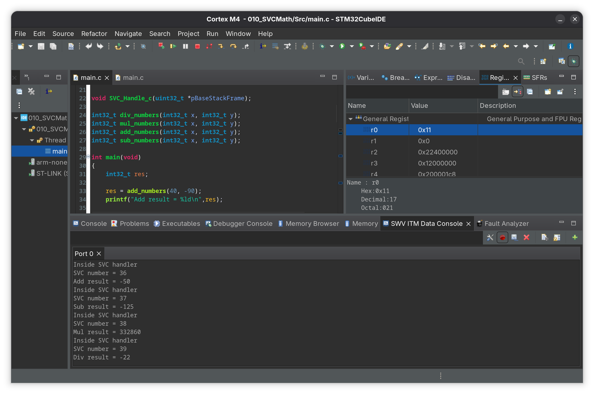

# 010_SVCMath

Code running at unprivileged level in main function requests Supervisor Call (SVC) to execute simple math operations 
like add, subtract, multiply and divide

- main.c calls `add_numbers` function and within the function `SVC #36` instructions runs
- A `naked` SVC_Handler extracts MSP via inline assembly and passes it to the SVC_Handler_c 
- The SVC_Handler_c extracts the SVC_number and uses switch case to perform the respective operation

## Cube ide showing the SWV ITM data console output 
 
