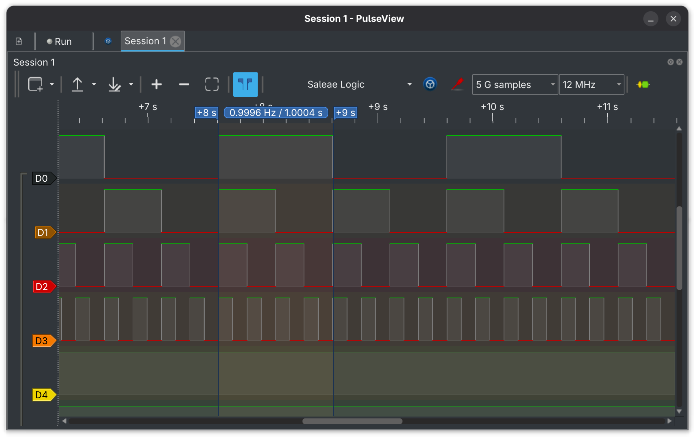

# 011_RoundRobin_Scheduler

A bare-metal round-robin scheduler for STM32 (Cortex-M4), built using inline assembly and without a RTOS. It manages 4 user tasks + 1 idle task using the SysTick timer and PendSV exception for context switching. (Scroll to see the working screenshot of leds being scheduled to turn on/off based on given user delay)
> Can add more tasks by updating the `MAX_TASKS` macro and adding the respective task handler

## How It Works

**Stack Setup**
Each task gets its own Process Stack Pointer (PSP) region. On init, fake stack frames are written for every task (xPSR, PC pointing to the task function, LR, and zeroed-out R4–R12), so the CPU can "resume" them as if they were interrupted mid-run.

**Scheduler Stack vs Task Stacks**
The MSP (Main Stack Pointer) is used exclusively by the scheduler/ISRs. Each task runs on its own PSP segment. `switch_sp_to_psp()` moves the CPU to PSP mode before the first task runs.

**Tick & Context Switch**
- `SysTick` fires at `TICK_HZ`, increments `g_tick_count`, unblocks any tasks whose delay has expired, then pends PendSV.
- `PendSV_Handler` does the actual context switch: saves R4–R11 of the outgoing task onto its PSP, calls `update_next_task()` to pick the next ready task, then restores R4–R11 from the new task's PSP. 
> (R0–R3, PC, LR, xPSR are saved/restored automatically by the hardware.)
```
Higher address
┌─────────────┐
│    xPSR     │  ← auto-saved by hardware (SF1)
│     PC      │
│     LR      │
│     R12     │
│     R3      │
│     R2      │
│     R1      │
│     R0      │
├─────────────┤
│     R11     │  ← manually saved by PendSV (SF2)
│     R10     │
│     R9      │
│     R8      │
│     R7      │
│     R6      │
│     R5      │
│     R4      │
└─────────────┘ ← PSP points here after save
Lower address
```

**Round-Robin + Blocking**
`update_next_task()` cycles through `user_tasks[]` in order, skipping blocked tasks. If no user task is ready, it falls back to the idle task (task 0).

`task_delay(ticks)` marks the calling task as `TASK_BLOCKED_STATE`, sets a `block_count` target, and immediately triggers a reschedule. `unblock_tasks()` (called from SysTick) sets a task back to `TASK_READY_STATE` when `g_tick_count` reaches its `block_count` target


## Task Summary

| Task | LED    | On/Off Period |
|------|--------|---------------|
| 1    | Green  | 1000 ms       |
| 2    | Orange | 500 ms        |
| 3    | Blue   | 250 ms        |
| 4    | Red    | 125 ms        |

### Pulseview showing the time periods of leds
 

## Memory Layout (Stack Regions)

```
High Address
┌──────────────┐ ← SCHED_STACK_START  (MSP for scheduler/ISR use)
├──────────────┤ ← T1_STACK_START
├──────────────┤ ← T2_STACK_START
├──────────────┤ ← T3_STACK_START
├──────────────┤ ← T4_STACK_START
└──────────────┘ ← IDLE_STACK_START
Low Address
```

## Fault Handlers

UsageFault, BusFault, MemManage, and HardFault are all enabled and trap into infinite loops with a diagnostic `printf`
