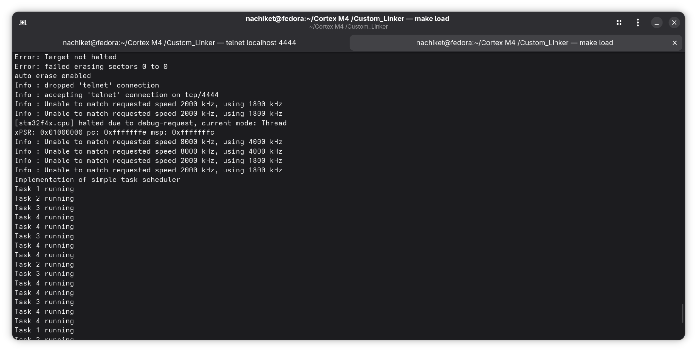
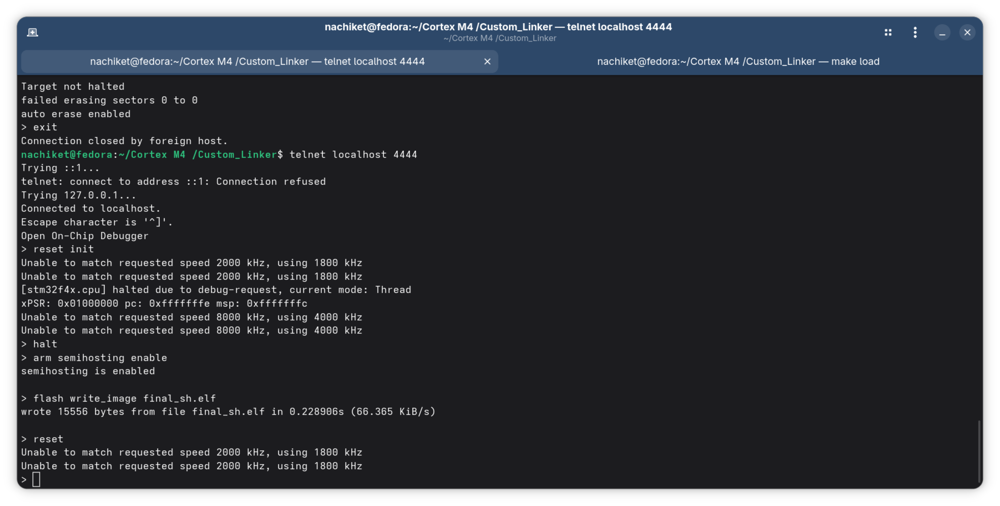

# 012 Custom Linker script

The bare metal round robin task scheduler from previous project is compiled with GNU ARM Embedded toolchain (arm-none-eabi-gcc), linked with a custom linker script, a custom startup file, and flashed via OpenOCD over SWD for the NUCLEO F446RE


## Project Structure

```
├── main.c              # Scheduler core, task definitions, SysTick & PendSV handlers
├── main.h              # Stack addresses, MAX_TASKS, TICK_HZ, state macros
├── led.c / led.h       # LED init and on/off helpers
├── stm32_startup.c     # Vector table, Reset_Handler, .data/.bss init
├── syscalls.c          # Newlib syscall stubs
├── stm32_ls.ld         # Custom linker script
└── Makefile            # Build system
```

## Semi-Hosting output and telnet terminal to give commands


 

## How to Build

**Normal build (no semihosting):**
```bash
make all
```

**Semihosting build (printf over debug port):**
```bash
make semi
```

**Clean:**
```bash
make clean
```


## How to Flash

Keep OpenOCD running in one terminal:
```bash
openocd -f /usr/share/openocd/scripts/board/st_nucleo_f4.cfg
```
or using makefile
```bash
make load
```


In a second terminal via telnet:
```bash
telnet localhost 4444
> halt
> arm semihosting enable     # only for semi build
> flash write_image erase final_sh.elf
> reset run
```

Or flash directly in one command (non-semihosting):
```bash
openocd -f /usr/share/openocd/scripts/board/st_nucleo_f4.cfg \
        -c "program final.elf verify reset exit"
```


**Boot sequence:**
1. CPU reads `0x08000000` → loads MSP
2. CPU reads `0x08000004` → jumps to `Reset_Handler`
3. `Reset_Handler` copies `.data` from FLASH to SRAM, zeros `.bss`, calls `main()`
4. `main()` initialises faults, scheduler stack, task stacks, LEDs, SysTick, switches SP to PSP, enters Task 1


## Task Summary

| Task | LED    | Period  |
|------|--------|---------|
| 1    | Green  | 1000 ms |
| 2    | Orange | 500 ms  |
| 3    | Blue   | 250 ms  |
| 4    | Red    | 125 ms  |


## Linker Script

```
FLASH: 0x08000000, 512KB  → .text, .rodata, .data (load)
SRAM:  0x20000000, 128KB  → .data (runtime), .bss, stacks
```

`_la_data` marks where `.data` initial values are stored in FLASH so `Reset_Handler` can copy them to SRAM at boot.


## Build Flags

| Flag | Purpose |
|------|---------|
| `-mcpu=cortex-m4` | Target CPU |
| `-mthumb` | Thumb-2 instruction set |
| `-mfloat-abi=soft` | Software floating point (required for libc_nano compatibility) |
| `--specs=rdimon.specs` | Semihosting build — printf over SWD debug port |
| `--specs=nano.specs` | Normal build — minimal newlib |


## Toolchain

```bash
arm-none-eabi-gcc    # compiler
arm-none-eabi-objdump -D -marm -Mforce-thumb main.o  # disassemble
arm-none-eabi-objdump -D final.elf                   # full dump
readelf -S main.o                                     # section info
openocd                                               # flash + debug
```


